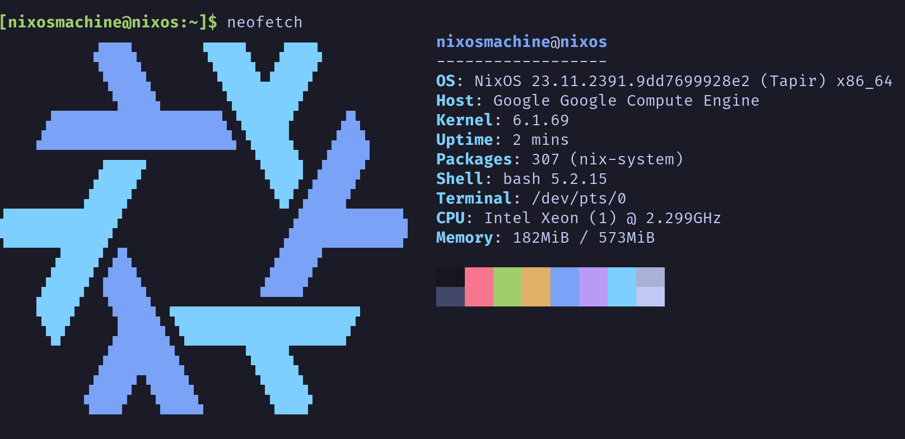

# Nixos Image Builder
This Packer template can be used to create an Nixos image that is compatible with GCP, QEMU and Xen.

## Usage

### Building an image
- Create the image using Packer:
`packer build nixos.pkr.hcl`
- Compress the image:
`tar --format=oldgnu -Sczf /tmp/nixos.tar.gz -C build disk.raw`

### Deployment in Google Cloud
If you already have a Cloud Storage bucket that you would prefer to use, replace the path `gs://nixos-gcp` in the commands below with the path to your own bucket.

- Create a Cloud Storage bucket:
`gsutil mb gs://nixos-gcp`
- Upload the compressed image to the bucket:
`gsutil cp /tmp/nixos.tar.gz gs://nixos-gcp`
- Import the image as a new custom image:
`gcloud compute images create nixos-gcp --source-uri gs://nixos-gcp/nixos.tar.gz`

You will now be able to create an instance using the image:
`gcloud compute instances create instance-name --zone zone --image nixos-gcp`

It is important to bear in mind that storing files in Cloud Storage will incur costs regardless of whether the image is in use by Compute Engine. To avoid this, consider periodically deleting unused/deprecated images from your Cloud Storage bucket.

### Deployment in AWS
*TODO*

### Deployment in Azure
*TODO*

## Configuration files
The `./files/config` directory contains a number of files which are copied to the generated image:

|Repo File                      |Location on image FS            |Purpose                                   |
|-------------------------------|--------------------------------|------------------------------------------|
|./files/config/ssh_public_key  |/home/gcp/.ssh/authorized_keys  |Default SSH public keys for account       |
|./files/config/ssh_private_key |--                              |Default SSH private keys for account      |

